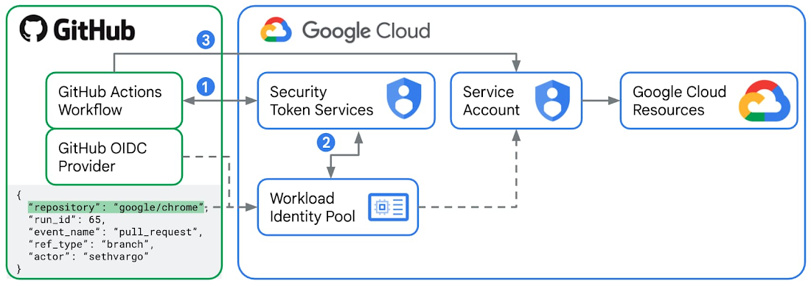

# One branch to rule them all | guided series \#4

Hello and welcome to the final part of the *One branch to rule them all* guided series\!

**spoiler:** the automated workflows we’ll implement today are a full-fledged CI/CD pipeline. If you’ve ever wondered how to introduce continuous integration and delivery practices into your projects, today is the day\!

| action | before | after tl;a|
|:---|:---|:---|
| run unit tests | 🚫 none | :white_check_mark: automated |
| create git tags | ❌ manual | :white_check_mark: automated |
| build and push Docker images | ❌ manual | :white_check_mark: automated |
| run integration tests | 🚫 none | :white_check_mark: automated |
| deploy to Cloud Run | ❌ manual | :white_check_mark: automated |

**tl;dr:** My goal for this short series is very simple: **teach you by example**. Together, we’re going through the full process I follow to solve various problems:

* 🔍 **gather and understand requirements**
* 🧠 **brainstorm solutions**
* 🎯 **scope**
* 👨🏻‍💻 **implement & test** (iterate until convergence)
* 🛑 **stop** (sounds easy? :p)

What are we working on in this series?

**🤔 PROBLEM DEFINITION** How to deploy an app to multiple environments so that each env can run a different version of the application?

You can access the code for what we’ve covered so far on [GitHub](https://github.com/toolongautomated/tutorial-1/tree/4-deployment).

---

# Recap

In the last post, the focus was on configuring multiple deployment targets to control which application version runs in staging and production environments. We ended up with a simple directory structure: ![][image1]

```
app/
docs/
deploy/
└── environments/
    ├── staging/
    │   └── .env 👈🏼 here
    └── production/
        └── .env 👈🏼 and here
```

* *deploy/environments* directory contains subdirectories dedicated to deployment targets
* *.env* files are used for env-specific configuration

I promised that next time we will automate several processes that currently need to be done manually:

* git tags creation
* Docker image building and pushing
* unit and integration tests execution
* application deployment

Without further due, let’s begin\!

# 👨🏻‍💻 Test

So far, the test suite of our mini-project was rather pathetic. No integration tests, and a single (\!) unit test — which, to make matters worse, was just a smoke test. Time to change that a little.

I want us to have a bunch of realistic unit and integration tests:

* **unit** tests to check if internal app functions return correct outputs given certain inputs

* **integration** tests to check whether a real application deployment returns expected responses and status codes given certain requests

To dive deeper into the testing topic, read more about [unit tests](https://martinfowler.com/bliki/UnitTest.html), [integration tests](https://martinfowler.com/bliki/IntegrationTest.html), and the [test pyramid](https://martinfowler.com/bliki/TestPyramid.html).

## Unit tests

Let’s introduce two helper functions:

```python
def dummy_helper_function(arg1: str, arg2: int) -> str:
    if not args_valid(arg1, arg2):
        raise ValueError("Invalid arguments")
    return arg2 * arg1


def args_valid(arg1: str, arg2: int) -> bool:
    if arg1 is None or arg2 is None:
        return False
    elif not isinstance(arg1, str):
        return False
    elif not isinstance(arg2, int) or isinstance(arg2, bool):
        return False

    return True
```

They aren’t useful in any terms – their only purpose of existence is to be tested.

There are three scenarios to be tested:

* `dummy_helper_function()`
  * given valid input produces expected output
  * given invalid input raises an exception

* `args_valid()`
  * given valid input produces expected output

To reuse test logic for various parameter combinations, we’ll use `@pytest.mark.parametrize` decorator. I highly recommend using it to reduce the volume of your tests. If it’s the first time you hear about it, you can learn more about it in [pytest docs](https://docs.pytest.org/en/stable/example/parametrize.html).

Here’s a test\_helpers.py file with all the aforementioned tests: [https://github.com/toolongautomated/tutorial-1/blob/5-automations/app/test/unit/test\_helpers.py](https://github.com/toolongautomated/tutorial-1/blob/5-automations/app/test/unit/test_helpers.py).

To run the tests, install the requirements:

```shell
cd app
pip install \-r requirements-test.txt
```

Then, run the unit tests:

```shell
cd app/
export PYTHONPATH=${PYTHONPATH}:$(pwd)
pytest test/unit \-v
```

It’s important to update `PYTHONPATH`, otherwise pytest will not be able to import `src/helpers.py` correctly.

## Integration tests

Integration tests check whether a real application deployment returns expected responses and status codes given certain requests. Unfortunately, the only thing our app does is it displays “Welcome to the too long; automated app\!” text once the user enters the `/` route. I like minimalism, but this is too minimalist to showcase something useful.

Let’s create a new endpoint that will return the name of the planet in our solar system given its position:

```python
from flask import jsonify, request

PLANETS = {
    1: "Mercury",
    2: "Venus",
    3: "Earth",
    4: "Mars",
    5: "Jupiter",
    6: "Saturn",
    7: "Uranus",
    8: "Neptune",
}


@app.route("/planet")
def get_planet():
    try:
        position = int(request.args.get("position", 0))
        if position < 1:
            return jsonify({"error": "Position must be greater than 0"}), 400

        if position in PLANETS:
            return jsonify({"planet": PLANETS[position]}), 200

        return jsonify({"error": f"No planet exists at position {position}"}), 404

    except ValueError:
        return jsonify({"error": "Position must be a valid integer"}), 400
```

As you can see, it also performs some internal validation. It’s great for our integration test suite as it enables checking both returned data and response’s status code.

There are four scenarios that we will test. As a quick exercise, try to understand them by peeking at their definition in the `@pytest.mark.parameterize` decorator in the code snippet below:

```python
import os
import pytest
import requests

ENDPOINT_URL = os.environ.get("ENDPOINT_URL")
if not ENDPOINT_URL:
    raise ValueError("ENDPOINT_URL environment variable must be set")


@pytest.mark.parametrize(
    "position, expected_status, expected_response",
    [
        (3, 200, {"planet": "Earth"}),
        (9, 404, {"error": "No planet exists at position 9"}),
        (-1, 400, {"error": "Position must be greater than 0"}),
        ("not_a_number", 400, {"error": "Position must be a valid integer"}),
    ],
)
def test_planet_endpoint(position, expected_status, expected_response):
    response = requests.get(f"{ENDPOINT_URL}/planet", params={"position": position})
    assert response.status_code == expected_status
    data = response.json()

    for key, value in expected_response.items():
        assert key in data
        assert value in data[key] if "error" in key else data[key] == value
```

Note that `test_planet_endpoint` test makes real requests, not mock ones. This is a key difference from the unit tests as it requires an application to a) be running and b) be accessible by the integration tests under the ENDPOINT\_URL path.

To run the tests, install the requirements:

```shell
cd app/
pip install \-r requirements-test.txt
```

Then, run the application:

```shell
cd app/src
export FLASK\_APP=main.py
gunicorn \-w 4 \-b 0.0.0.0:80 main:app
```

Finally, in a separate terminal tab/window:

```shell
cd app/
export ENDPOINT\_URL=http://localhost:80
pytest test/integration \-v
```


Source: [tenor.com](https://tenor.com/pl/view/m2-gif-15210525624480627001)

# 🚀 GitHub Actions workflows

Now that all the pieces of our project are in place, let’s talk about CI/CD.

During active project development, new features/fixes need to be integrated into the main branch on a regular basis. We’re working in a [permissive trunk-based development](https://www.toolongautomated.com/posts/2024/one-branch-to-rule-them-all-1.html#option-2-permissive-trunk-based-development) setup, so merges will happen frequently (at least several times a week). It means a lot of manual tagging, building and pushing Docker images, running unit tests, running integration tests. **That’s a lot to do, and a lot to remember, huh?**

One thing I truly enjoy about reliable automations is that it frees up your memory – you no longer need to remember all those things that must be done once certain conditions are met, thus the **probability of an error caused by omissions reduces significantly**.

That’s why we need Continuous Integration (CI part of the CI/CD term). Continuous Delivery (CD part of the CI/CD term) is about frequent, automated deployments of new app versions to production environments. In our case, CD means deploying to Cloud Run on a regular basis.

Let’s see what we need:

| Action | Trigger | Effects | Required permissions |
| :---: | ----- | ----- | ----- |
| [unit tests](#run-unit-tests) | pull request opened or new commits added to it (only if it contains changes that affect unit test results) | new comment in pull request with the test results if fails, PR gets blocked and merging can’t be done | update PR checks create & modify PR comments |
| [git tags](#git-tags--docker-image-build--push) | modified application code is pushed into main branch | git tag created | create git tags |
| [building and pushing Docker images](#git-tags--docker-image-build--push) | new application tag released | Docker image built and  pushed to Docker Hub | push images to Docker Hub |
| [integration tests](#integration-tests) | pull request opened or new commits added to it (only if it contains changes to .env files in the deploy/environments directory) | temporary deployment of a new app version to test environment that will be used to test by the integration tests new comment in pull request with the test results if fails, PR gets blocked and merging can’t be done | update PR checks create & modify PR comments create and delete Cloud Run deployments |
| [Cloud Run deployment](#deploy-to-cloud-run) | modified .env file is pushed into main branch | deployment updated | create & modify Cloud Run deployments |

I know it is a lot of information to digest, so take as much time as you need to soak it in. Once you’re ready, jump back in.

We will use this table as a recipe to create automated workflows in GitHub Actions:

> When **\[TRIGGER\],** run Github Actions workflow that will execute **\[ACTION\]** and produce **\[EFFECTS\]**. Grant **\[REQUIRED PERMISSIONS\]** or it will fail.

Makes sense?


Source: [tenor.com](https://tenor.com/pl/view/mm-aha-shocked-gif-14571374171980850856)

If you look carefully at the table, you will notice that executing integration tests and updating Cloud Run deployments **require permissions to create, modify, or delete Cloud Run deployments**.

Modifying cloud resources directly from GitHub Actions workflow is very convenient, but may also pose a security risk to your cloud environment.

Why is that? Let me explain.

## 🔑 Authorize Github Actions workflows to manage Google Cloud resources securely using Workload Identity Federation

Traditional solution to authorizing CI/CD workflows to modify cloud environments is by using service accounts.

**Don’t do it, I’m begging you 🙏🏼**

> Traditionally, authenticating from GitHub Actions to Google Cloud required exporting and storing a long-lived JSON service account key, **turning an identity management problem into a secrets management problem**. Not only did this introduce additional security risks if the service account key were to leak, but it also meant developers would be unable to authenticate from GitHub Actions to Google Cloud if their organization has disabled service account key creation (a common security best practice) via organization policy constraints like constraints/iam.disableServiceAccountKeyCreation.*
>
> source: [Google Cloud blog](https://cloud.google.com/blog/products/identity-security/enabling-keyless-authentication-from-github-actions)

GitHub was well aware of that. In 2021, they introduced support for OpenID Connect (OIDC) to enable secure cloud deployments using short-lived tokens. It leverages security mechanisms of cloud providers to ensure GitHub Actions workflows get **very narrow access** to cloud resources. Plus, there’s **no need for storing any long-lived secrets like service account keys** in GitHub.


Source: [tenor.com](https://tenor.com/pl/view/look-holy-moly-omg-whoa-gif-22960590)

GItHub’s support for OIDC made it compatible with the Google Cloud’s mechanism called **Workload Identity Federation**.



Source: [storage.googleapis.com](https://storage.googleapis.com/gweb-cloudblog-publish/images/2_GitHub_Actions.max-1100x1100.jpg)

With Workload Identity Federation, Identity and Access Management (IAM) can be used to grant external identities (like GitHub repositories/users/branches) IAM roles, and thus direct access to Google cloud resources. It is also possible to let these external identities [impersonate service accounts](https://cloud.google.com/iam/docs/service-account-impersonation). You can read more about the integration between GitHub and Google Cloud in [this blog post](https://cloud.google.com/blog/products/identity-security/enabling-keyless-authentication-from-github-actions).

For a full list of all the services that are supported by Workload Identity Federation, check out [this resource](https://cloud.google.com/iam/docs/federated-identity-supported-services?utm_source=chatgpt.com). Some of the services have more or less severe limitations, so keep that in mind when considering this authorization approach.

In this project, we need to grant permission to GitHub Actions workflow to **create/modify/delete Cloud Run deployments**. It’s fully supported by Workload Identity Federation, so nothing to worry about\!

In order to make Workload Identity Federation work properly, we will need to set up the following pieces:

- **workload identity pool** (to manage GitHub identities)
- **workload identity pool provider** (to describe a relationship between Google Cloud and GitHub)
- **custom IAM role** (to grant GitHub Actions workflow strictly permissions it requires, but nothing more)
- **IAM policy binding** (to bind GitHub identity with the aforementioned role)

We’re going to use gcloud CLI to do that, so [ensure you have it configured  on your local machine](https://www.toolongautomated.com/posts/2025/one-branch-to-rule-them-all-3.html#configure-gcloud-cli) before proceeding.

### Workload identity pool

Workload identity pool will let us manage external identities, e.g. GitHub identities like repository owner, repository, user, or branch. To create a workload identity pool called “github”, run the command below:

```shell
PROJECT_ID="toolongautomated"
POOL_NAME="github"
POOL_DISPLAY_NAME="Github Actions Pool"

gcloud iam workload-identity-pools create $POOL_NAME \
    --project=$PROJECT_ID \
    --location="global" \
    --display-name=$POOL_DISPLAY_NAME \
    --format="value(name)"
```

### Workload identity pool provider

Workload identity pool **provider** will make it possible to describe a relationship between Google Cloud and GitHub. To create a workload identity pool provider called “toolongautomated”, run the command below:

```shell
# Update these variables to reflect your project.
PROJECT_ID="toolongautomated"
REPO_OWNER="toolongautomated"
POOL_NAME="github"
PROVIDER_NAME="toolongautomated"
PROVIDER_DISPLAY_NAME="Github Actions identity provider"

gcloud iam workload-identity-pools providers create-oidc $PROVIDER_NAME \
    --project=$PROJECT_ID \
    --location="global" \
    --workload-identity-pool=$POOL_NAME \
    --display-name=$PROVIDER_DISPLAY_NAME \
    --attribute-mapping="google.subject=assertion.sub,attribute.actor=assertion.actor,attribute.repository=assertion.repository,attribute.repository_owner=assertion.repository_owner" \
    --attribute-condition="assertion.repository_owner == '$REPO_OWNER'" \
    --issuer-uri="https://token.actions.githubusercontent.com"
```

### Custom IAM role

In order to manage Cloud Run deployments, there are several permissions the entity needs to be granted beforehands. Let’s define the role in a YAML and save it to a file `infrastructure/cloud_run_deployer_role.yaml`:

```yaml
title: cloud_run_deployer
description: Cloud Run Deployer Role
stage: GA
includedPermissions:
  - run.services.create
  - run.services.delete
  - run.services.update
  - run.services.get
  - run.services.setIamPolicy
  - run.services.getIamPolicy
  - run.operations.get
  - artifactregistry.repositories.downloadArtifacts
  - iam.serviceAccounts.actAs
```

Then, the following command can be run to create the role in Google Cloud:

```shell
PROJECT_ID="toolongautomated"

gcloud iam roles create cloud_run_deployer \
    --project=$PROJECT_ID \
    --file=infrastructure/cloud_run_deployer_role.yaml
```

The last thing is to bind the role to the GitHub’s identities.

### IAM policy binding

To create a binding, one gcloud command will suffice:

```shell
PROJECT_ID="toolongautomated"
WORKLOAD_IDENTITY_POOL_ID="[THIS IS THE OUTPUT OF THE Workload identity pool STEP]"
REPO_OWNER="toolongautomated"
REPO_NAME="tutorial-1"
PRINCIPAL="principalSet://iam.googleapis.com/${WORKLOAD_IDENTITY_POOL_ID}/attribute.repository/${REPO_OWNER}/${REPO_NAME}"

gcloud projects add-iam-policy-binding $PROJECT_ID \
    --member=$principal \
    --role="projects/$PROJECT_ID/roles/cloud_run_deployer"
```

### Bonus: wrap into `manage setup-iam` command

All the steps above can be wrapped into a convenient bash script (see full script [here](https://github.com/toolongautomated/tutorial-1/blob/5-automations/manage)):

```shell
...

"setup-iam")
    if [ -z "$2" ] || [ -z "$3" ] || [ -z "$4" ]; then
        echo "Error: Missing required arguments"
        help
        exit 1
    fi

    repo_owner="$2"
    repo_name="$3"
    project_id="$4"

    # Create a new workload identity pool for GitHub Actions
    workload_identity_pool_id=$(gcloud iam workload-identity-pools create "github" \
        --project="$project_id" \
        --location="global" \
        --display-name="GitHub Actions Pool" \
        --format="value(name)")

    # Create a new provider for the GitHub Actions pool.
    gcloud iam workload-identity-pools providers create-oidc "$repo_name" \
        --project="$project_id" \
        --location="global" \
        --workload-identity-pool="github" \
        --display-name="GitHub Actions identity provider" \
        --attribute-mapping="google.subject=assertion.sub,attribute.actor=assertion.actor,attribute.repository=assertion.repository,attribute.repository_owner=assertion.repository_owner" \
        --attribute-condition="assertion.repository_owner == '$repo_owner'" \
        --issuer-uri="https://token.actions.githubusercontent.com"

    # Get the full identity provider name.
    full_provider_name=$(gcloud iam workload-identity-pools providers describe "$repo_name" \
        --project="$project_id" \
        --location="global" \
        --workload-identity-pool="github" \
        --format="value(name)")

    # Create a custom role for the GitHub Actions workflow to use to deploy to Cloud Run.
    gcloud iam roles create cloud_run_deployer --project="$project_id" \
        --file=infrastructure/cloud_run_deployer_role.yaml

    principal="principalSet://iam.googleapis.com/${workload_identity_pool_id}/attribute.repository/${repo_owner}/${repo_name}"

    # Create and configure IAM policy binding for the custom role.
    gcloud projects add-iam-policy-binding "$project_id" \
        --member="$principal" \
        --role="projects/$project_id/roles/cloud_run_deployer"

    echo "Full provider name: $full_provider_name. Copy this value to your GitHub Actions workflow (google-github-actions/auth@v2 step)"
    echo ""
    echo "IAM resources created successfully!"
    ;;

...
```

## git tags + Docker image build & push

\[placeholder\]

You may wonder:

> Why put docker image building and pushing together with git tag creation in the same workflow, not in two separate ones?

Initially, that's precisely what I wanted to do. My plan was to have one workflow that would trigger whenever a new version of the application is released and create a new git tag as a result.Then, the second workflow would monitor for new tag creation and build and push new Docker image to the registry. Unfortunately, I found out that if the tag gets created automatically via GitHub Actions workflow, **it does not trigger downstream workflows (see [this discussion](https://github.com/orgs/community/discussions/27028) on GitHub).** Some people suggested attaching my PAT to the workflow and let it impersonate these credentials, however, I didn't like this approach (it felt too hacky). Eventually, I realized that merging the two into a single GitHub Actions workflow is not such a bad idea, so that's what I did.

---

Whenever a new version of the application is released, a **new git tag will be created first**.

It will happen automatically through the [`tag_build_push`](https://github.com/toolongautomated/tutorial-1/blob/5-automations/.github/workflows/tag_build_push.yaml) GitHub Actions workflow. This workflow will trigger on pushes to the `main` branch, whenever changes are made to application-related files.

The workflow should fail if:

❌ application-related files are modified without updating changelog

❌ changelog version unchanged from previous version, even though app-related source files were modified as part of the commit

❌ new tag would be created but it already exists

The workflow relies on the `app/CHANGELOG.md` and requires it to follow a specific format:

```md
# Sample changelog file

## 1.0.1

Changes description...

## 1.0.0

Initial release…
```

- each version must be a level-2 header (`##`)
- version numbers must follow semantic versioning (`X.Y.Z`)
- latest version should be at the top of the file

Here are the first two jobs responsible for the above:

```yaml
name: Maybe create a tag for a new release of the app and build its Docker image

on:
  push:
    branches:
      - main
    paths:
      - 'app/src/*.py'
      - 'app/requirements.txt'
      - 'app/Dockerfile'
      - 'app/.dockerignore'

jobs:
  verify-changelog:
    runs-on: ubuntu-22.04
    outputs:
      changelog-updated: ${{ steps.changes.outputs.app }}
    steps:
      - name: Checkout repository
        uses: actions/checkout@v4

      - name: Check if CHANGELOG.md was updated
        uses: dorny/paths-filter@v3
        id: changes
        with:
          filters: |
            app:
              - 'app/CHANGELOG.md'

      - name: Fail if CHANGELOG.md was not updated
        if: steps.changes.outputs.app == 'false'
        run: |
          echo "Error: Changes detected in app files but CHANGELOG.md was not updated"
          exit 1

  tag:
    needs: verify-changelog
    runs-on: ubuntu-22.04
    outputs:
      tag: ${{ steps.tag_version.outputs.tag }}
    permissions:
      contents: write
    steps:
      - name: Checkout repository
        uses: actions/checkout@v4
        with:
          fetch-depth: 2

      - name: Detect and tag new version
        id: tag_version
        uses: salsify/action-detect-and-tag-new-version@v2
        with:
          tag-template: '{VERSION}'
          version-command: "sed -n 's/^## \\([0-9]\\+\\.[0-9]\\+\\.[0-9]\\+\\)/\\1/p' app/CHANGELOG.md | head -n 1"
          tag-annotation-template: 'Released version {VERSION} of the app'
```

Once the tag is successfully created, the `tag_build_push` workflow proceeds to **building a Docker image and pushing it to Docker Hub** (registry provider used purely for illustrative purposes).

```yaml
...

  build:
    needs: tag
    if: needs.tag.outputs.tag
    runs-on: ubuntu-22.04
    steps:
      - name: Checkout repository
        uses: actions/checkout@v4

      - name: Set up Docker Buildx
        uses: docker/setup-buildx-action@v3

      - name: Log in to Docker Hub
        uses: docker/login-action@v3
        with:
          username: ${{ secrets.DOCKER_USERNAME }}
          password: ${{ secrets.DOCKER_TOKEN }}

      - name: Extract Docker metadata
        id: meta
        uses: docker/metadata-action@v4
        with:
          images: toolongautomated/tutorial-1
          tags: |
            type=raw,value=latest
            type=raw,value=${{ needs.tag.outputs.tag }}

      - name: Build and push Docker image
        uses: docker/build-push-action@v4
        with:
          context: app
          push: true
          tags: ${{ steps.meta.outputs.tags }}
          cache-from: type=gha
          cache-to: type=gha,mode=max
```

See the full workflow [here](https://github.com/toolongautomated/tutorial-1/blob/5-automations/.github/workflows/tag_build_push.yaml).

To push images to Docker Hub, a personal access token (PAT) with the necessary permissions is required. You can create a PAT using a dedicated [Docker Hub settings page](https://app.docker.com/settings/personal-access-tokens).

Ensure that the token has `Read & Write` scopes.

Once the PAT is created, it needs to be added to the GitHub repository secrets:

1. Go to the repository settings, click on `Secrets and variables`, and then click on `New repository secret`.
2. Add two secrets: `DOCKER_USERNAME` (Docker Hub account username) and `DOCKER_TOKEN` (PAT).

Check out tutorial’s [GitHub repo](https://github.com/toolongautomated/tutorial-1/blob/5-automations/.github/workflows/tag_build_push.yaml) for the source of the full workflow.

## Deploy to Cloud Run

\[placeholder\]

The `deploy` GitHub Actions workflow can deploy the application to Cloud Run. It will be triggered on every push to the `main` branch, whenever any of the `.env` files gets modified. Why Cloud Run? As mentioned in my [previous article](https://www.toolongautomated.com/posts/2025/one-branch-to-rule-them-all-3.html#deploy-to-cloud-run),  Google Cloud Platform offers a [free tier](https://cloud.google.com/free/docs/free-cloud-features). As part of it (as of 2025-01-20), you can use Cloud Run for free (to some extent). Cloud Run lets you run your app in containers without worrying about servers. It scales up and down as needed and only costs when it's running. It's great for small services and APIs. That all makes it particularly useful for our scenario.

As a quick recap: `deploy/environments` directory contains subdirectories, each storing a `.env` file associated with the deployment environment. Name of the subdirectory corresponds to the name of the environment it serves (case-specific\!). `deploy` workflow monitors for changes in these files. **If multiple `.env` files are modified, the workflow will deploy the application to all affected environments.**

To enable Workload Identity Federation as an authentication mechanism, several resources need to be created. Install `gcloud` CLI and use `setup-iam` command from the `manage` script to configure:

- a new workload identity pool for GitHub Actions
- a new provider for the GitHub Actions pool
- a new IAM role for the GitHub Actions pool
- a new IAM policy binding for the GitHub Actions pool

The command template is:

```shell
./manage setup-iam [REPO_OWNER] [REPO_NAME] [PROJECT_ID]
```

Example:

```shell
./manage setup-iam toolongautomated tutorial-1 toolongautomated
```

`setup-iam` outputs the full identity provider name. Use it in the `deploy` GitHub Actions workflow:

```yaml
- name: 'Authenticate to Google Cloud'
  uses: 'google-github-actions/auth@v2'
  with:
    project_id: '[GCP_PROJECT_ID]'
    workload_identity_provider: '[FULL_PROVIDER_NAME]'
```

Example:

```yaml
- name: 'Authenticate to Google Cloud'
  uses: 'google-github-actions/auth@v2'
  with:
    project_id: 'toolongautomated'
    workload_identity_provider: 'projects/572404090605/locations/global/workloadIdentityPools/github/providers/tutorial-1'
```

Check out [this link](https://github.com/toolongautomated/tutorial-1/blob/main/.github/workflows/deploy.yaml) for the full `deploy` workflow source.

> 🚨 **Remember**
>
> Once done playing with the Cloud Run deployment, remember to delete the service. Otherwise, you may be charged for running it for too long outside of the free tier. Read more about it [here](https://www.toolongautomated.com/posts/2025/one-branch-to-rule-them-all-3.html#deploy-to-cloud-run).

`delete` command can be used to delete the service:

```shell
./manage delete [ENVIRONMENT] [PREFIX]
```

Prefix is optional and will be attached to the service name. Example:

```shell
./manage delete staging test
```

This will attempt to delete the service `test-[SERVICE NAME]-staging`.

## Run unit tests

\[placeholder\]

Whenever a pull request is opened or a new commit is added to it, the `test_unit` workflow will be executed. It will run unit tests and publish the results to the PR as a comment if any of the application-related files are modified.

Check out the source [here](https://github.com/toolongautomated/tutorial-1/blob/main/.github/workflows/test_unit.yaml).

## Run Integration tests

\[placeholder\]

The `test_integration` workflow runs integration tests whenever `.env` files are modified in a pull request. For each modified environment:

1. Deploys a test instance to Cloud Run with test- prefix.
2. Runs integration tests against the deployed instance.
3. Posts test results as a PR comment.
4. Deletes the test instance.

The workflow requires the same GCP authentication setup as the `deploy` workflow.

Last but not least, here’s the [source](https://github.com/toolongautomated/tutorial-1/blob/main/.github/workflows/test_integration.yaml). I believe the code is self-explanatory, but if anything is unclear or raises extra questions in your head, feel free to reach out to me. I’ll do my best to help with your confusion and update the article accordingly.

# 🛑 Stop

Being a perfectionist, I suffer from a severe syndrome: having a hard time saying “done”. I know how it sounds, but trust me – if you become passionate enough about what you’re building and start simply enjoying the design and coding processes, it’s so hard to stop. The reason is quite simple:

Code & architecture can always be improved.

Keep in mind, my friend, that our goal as developers is not to deliver perfect solutions – we need to build things that are **good enough for our clients**. Remind yourself of that whenever you find yourself trying too hard to achieve perfection.

Don’t let this trap catch you, buddy.


Source: [tenor.com](https://tenor.com/pl/view/mr-bean-wink-trust-me-funny-gif-12503093)

# 🏁 Conclusion

Dang, this is really it... We've reached the end of this guided series!

I hope you not only enjoyed the ride, but also learned something new. Now, you
should better understand the full process, from requirements gathering to the very
deployment (and even some basic automation).

If you liked this series, please consider sharing it with your friends and colleagues.

If you have any questions or feedback, please let me know. I'd love to hear from you.

Thanks for reading and hope to see you around!
